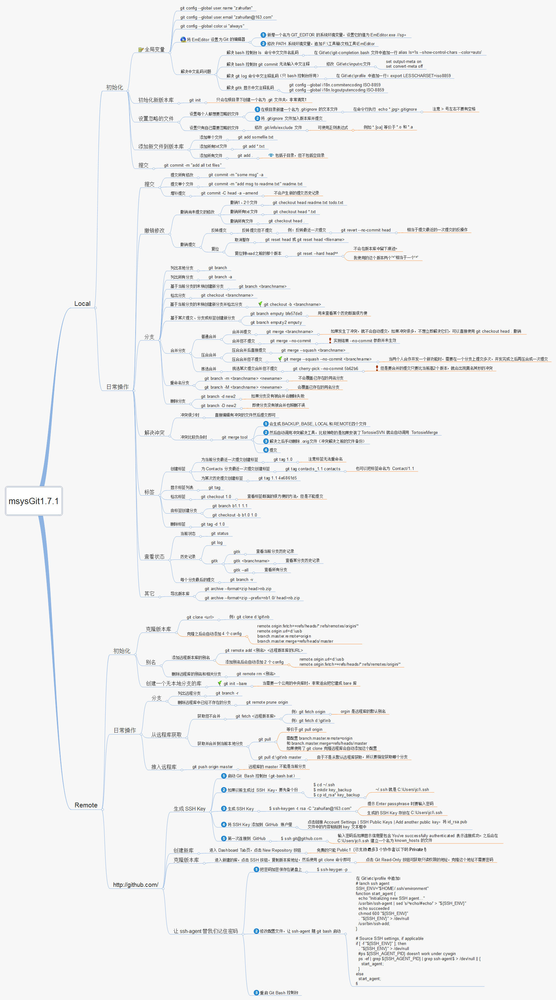

## 认识[Git](https://git-scm.com/)

> Git 是一个开源的分布式版本控制系统，用于敏捷高效地处理任何或小或大的项目。
>
> Git 是 Linus Torvalds 为了帮助管理 Linux 内核开发而开发的一个开放源码的版本控制软件。
>
> Git 与常用的版本控制工具 CVS, Subversion 等不同，它采用了分布式版本库的方式，不必服务器端软件支持。

## 概念理解

> - 工作区：改动（增删文件和内容）
> - 暂存区：输入命令：`git add 改动的文件名`，此次改动就放到了 ‘暂存区’
> - 本地仓库(简称：本地)：输入命令：`git commit 此次修改的描述`，此次改动就放到了 ’本地仓库’，每个 commit，我叫它为一个 ‘版本’。
> - 远程仓库(简称：远程)：输入命令：`git push 远程仓库`，此次改动就放到了 ‘远程仓库’（GitHub 等)

## [Git的奇技淫巧](https://github.com/521xueweihan/git-tips)

