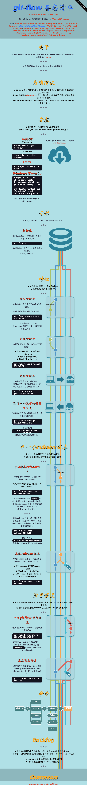

> git-flow 是一个 git 扩展集，按 Vincent Driessen 的分支模型提供高层次的库操作。[查看详情](http://nvie.com/posts/a-successful-git-branching-model/)

## 安装

```bash
# Linux
apt-get install git-flow

# macOS
brew install git-flow-avh

# windows
wget -q -O - --no-check-certificate https://raw.github.com/petervanderdoes/gitflow-avh/develop/contrib/gitflow-installer.sh install stable | bash
```

## 使用

```bash
# 初始化工作流仓库
git flow init -d

# newBranch 为新建的功能分支
git flow feature start newBranch　
```

## [git-flow备忘清单](https://danielkummer.github.io/git-flow-cheatsheet/index.zh_CN.html)

