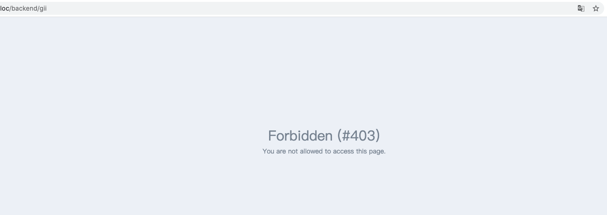
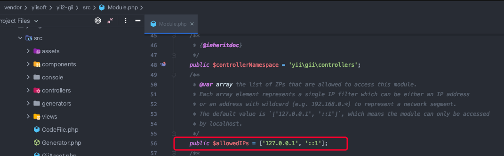
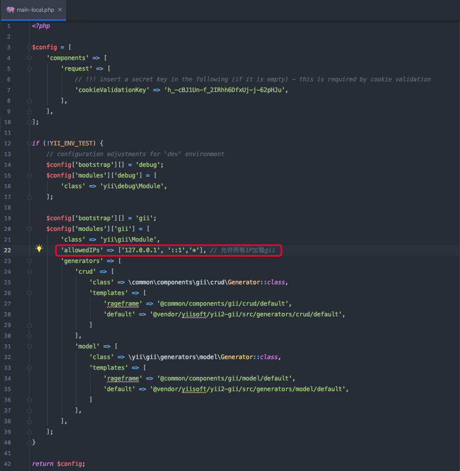
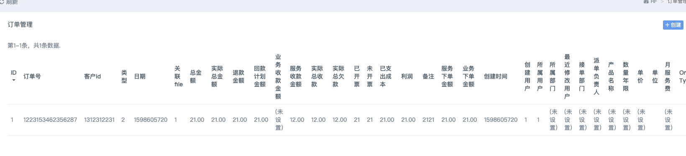
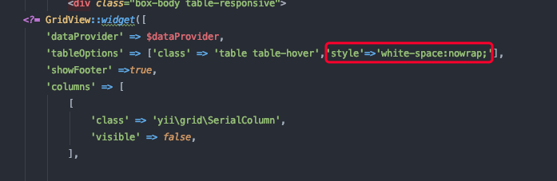

## 访问gii模块403

在Yii2-gii源码文件中(`vendor/yiisoft/yii2-gii/src/Module.php`)可以看到有一个配置项`$allowedIPs`（允许访问此模块的IP列表），默认允许访问的IP是127.0.0.1

### 解决方案

方法一：直接修改源码文件（`/vendor/yiisoft/yii2-gii/src/Module.php`）,在配置项`$allowedIPs`中加入自己的ip即可

方法二(推荐)：本着不修改源码的原则，我们需要修改配置文件(`backend/config/main-local.php`)的配置项，修改示例如下图：
我这里本地修改的是允许所有ip访问，当然你也可以换成固定的ip。

## 设置表头强制不换行

> 在Yii2中使用GridView生成的表格有一个小问题，那就是表头的列宽是根据列的值自适应的，但有时值的长度比较小，表头就会出现下面这种情况（表头不在同一行，非常的不利于数据的查看）

### 关键词

`'style'=>'white-space:nowrap;'`

### 效果图

