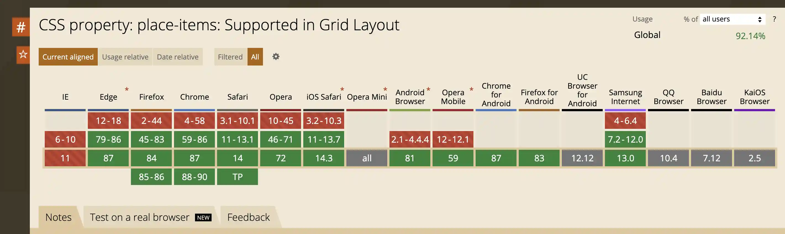

在 CSS 中，最方便的居中方式就是使用 flex 布局或 grid 布局，利用 align 和 justify 分别设置垂直和水平方向上居中对齐，这样需要 3 行代码才能实现。有没有办法使用 2 行代码就实现呢？答案是有的。

import BVideo from "@site/src/components/BVideo";

<BVideo src="//player.bilibili.com/player.html?aid=331491643&bvid=BV1SA411u7Lv&cid=289521782&page=1" bsrc="https://www.bilibili.com/video/BV1SA411u7Lv/"/>


## 解决方法

针对 flex 和  grid 布局，CSS 中有一个 place-items 属性，用于同时设置 align-items 和 justify-items 属性。由于 justify-items 在 flex 布局下会被忽略，所以其实只在 grid 布局中有效。假设有这样的 HTML 结构，想要居中 class 为 content 的元素：

```
<div class="grid">
  <div class="content">😊</div>
</div>
```

那么 CSS 核心的代码就是这样：

```
.grid {
  display: grid;
  place-items: center;
}
```

把 place-items 设置为 center 就相当于是同时把 align-items 和 justify-items 属性值设置为 center 。要注意的是，想要在整个页面垂直居中元素需要给容器的高度设置为 100 vh。

place-items 也可以指定两个值，分别给 align-items 和 justify-items 设置对齐方式，取值范围一样，例如：

- 靠右上对齐，place-items: start end
- 居中靠上对齐，place-items: start center
- 靠左下对齐，place-items: end start
- 靠右下对齐，place-items: end end

这个属性同样的，跟 IE 无缘



好了，这个就是 2 行 CSS 代码居中元素的教程，示例代码可以从视频简介中的 github 仓库地址找到。如果觉得视频有帮助请三连，想优雅的学前端，请关注为牧前端工程师，感谢观看！